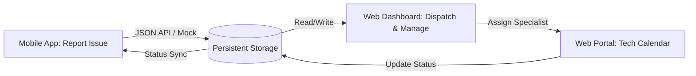
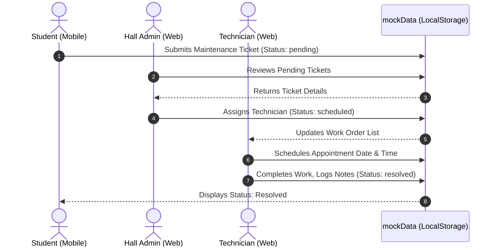
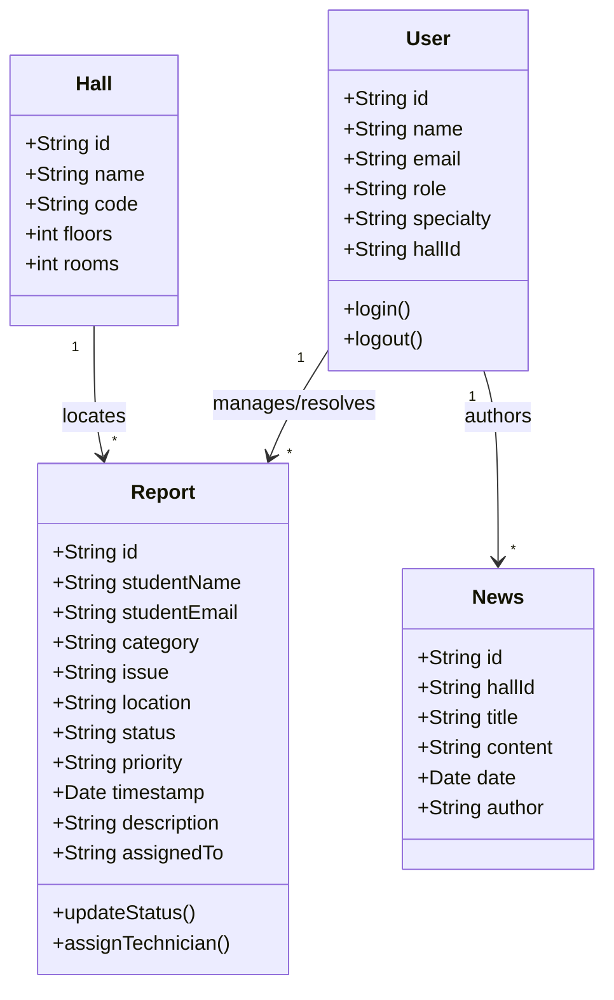
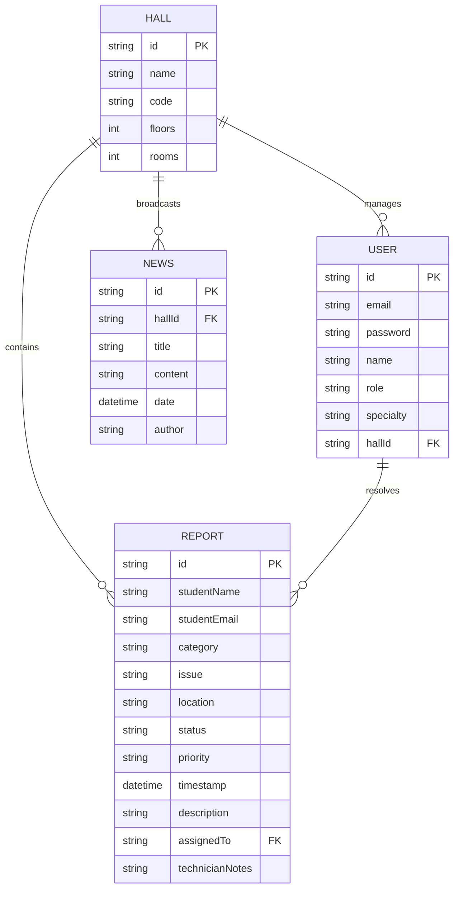

# KNUST Hall Maintenance System - Web Admin & Technician Portal
## Technical Project Documentation
*Structured according to the KNUST College of Engineering Project Documentation Guidelines*

---

## Document Metadata
- **Project Title:** KNUST Hall Maintenance System (Web Admin & Technician Dashboard)
- **Target Platform:** Desktop Web Browsers
- **Development Stack:** React (v19), React Router DOM (v7), React Icons, LocalStorage Persistence
- **Integration Partner:** HallMaintenance Mobile Client (React Native + Expo)
- **Author:** System Development Team

---

# Table of Contents
1. [Chapter 1: Introduction](#chapter-1-introduction)
2. [Chapter 2: Review of Related Works / Similar Systems](#chapter-2-review-of-related-works--review-of-similar-systems)
3. [Chapter 3: Methodology](#chapter-3-methodology)
4. [Chapter 4: Implementation and Results](#chapter-4-implementation-and-results)
5. [Chapter 5: Findings and Conclusion](#chapter-5-findings-and-conclusion)
6. [References](#references)

---

# Chapter 1: Introduction

### Problem Statement
In traditional university residential halls, specifically across the campus of Kwame Nkrumah University of Science and Technology (KNUST), maintenance reporting is largely manual. When an infrastructural defect occurs (such as a blown fuse, leaking faucet, or jammed lock), students must walk to the hall porter's lodge and record the details in a physical logbook. This process suffers from critical deficiencies:
- **Transcription & Legibility Issues:** Written complaints are often illegible or lack details, forcing administrators to make repeated room visits just to diagnose simple problems.
- **Assignment Delays:** Dispatching technicians is slow and lacks structure. Administrators have no clear dashboard to view who is available or what tasks are pending.
- **Zero Transparency:** Students receive no status updates or confirmations once they submit an issue, leading to frustration and double-reporting.
- **Lack of Analytical Records:** There is no persistent record of recurring infrastructure breakdowns, preventing data-driven estate decisions.

### Aim of the Project
The primary aim is to design and develop a web-based management portal (**Admin-Dashboard**) integrated with a mobile client (**HallMaintenance**), providing a centralized, automated platform for managing residential hall maintenance requests, coordinating technician workflows, publishing announcements, and tracking facility conditions in real-time.

### Specific Objectives of the Project
1. **Role-Based Web Portal:** Build a responsive web portal supporting three distinct access tiers: Super Admin, Hall Admin, and Technician.
2. **Interactive Dispatch System:** Create an interface for Hall Admins to review incoming reports, filter them by urgency/category, and assign technicians based on trade specialties (Electrical, Plumbing, Carpentry, Masonry).
3. **Technician Workflow Management:** Construct a dedicated technician interface to view assignments, schedule appointments with students, log repair notes, and mark tasks as resolved.
4. **Data Synchronization and Analytics:** Design a local data synchronization engine to simulate API communication, displaying overall and hall-specific maintenance statistics (resolution rates, pending tickets, breakdown by category).
5. **Staff and Location Controls:** Provide Super Admins with tools to register new staff, manage student directories, and configure campus infrastructure layouts (halls, floors, rooms).

### Justification of Project
Digitizing the facility management process directly addresses administrative inefficiencies. Automated dispatching saves hours of daily coordination, ensures technicians are assigned based on their specific skills, and creates audit trails. Furthermore, providing real-time communication channels between students, admins, and technicians reduces down-time and improves the overall quality of campus life.

### Motivation for Undertaking Project
The motivation stems from the need to apply modern web technology frameworks (specifically React 19) to address day-to-day operational challenges in large educational institutions. Integrating user-centric UI/UX design (using Google's Material Design principles) with robust client-side state machine concepts demonstrates how engineering principles can optimize public infrastructure maintenance.

### Scope of Project
The web application acts as the management backend. The scope includes:
- Role-based login and route guarding.
- Dashboard analytics (aggregate metrics, status distributions, category-wise issue frequency).
- CRUD operations for student files, staff (halls admins and technicians), and campus locations.
- Technician-specific appointment scheduling and status updates.
- Announcement/news authoring with hall-level targeting.

### Project Limitations
- **Simulated Backend:** The system utilizes a persistent client-side data store (`localStorage`) and mock structures, rather than an active remote SQL database.
- **Hardware Integration:** The application does not interface directly with smart building sensors or building management systems (BMS).
- **Communication Gateways:** Real email or SMS integrations are simulated via notifications instead of active SMTP/SMS gateways.

### Beneficiaries of the Project
- **University Estate Department & Super Admins:** Receive a high-level operational overview of all residential zones.
- **Hall Administrations (Hall Admins):** Can manage tasks within their halls without physical paperwork.
- **Maintenance Technicians:** Receive structured work schedules and direct feedback channels.
- **Residential Students:** Experience faster repair times and transparent progress tracking.

### Academic and Practical Relevance of the Project
- **Academic:** Explores React 19 architecture, routing states via React Router DOM v7, modular Component Design, and client-side data persistence mechanisms.
- **Practical:** Creates a deployable prototype addressing campus maintenance needs, showing how a client-server architecture bridges student requests with technical resolutions.

### Project Activity Planning and Schedules
The project followed an Agile Scrum process across a 4-sprint timeline:

| Sprint | Phase | Key Tasks | Deliverables |
|--------|-------|-----------|--------------|
| **Sprint 1** | Requirement & Design | Define roles, user stories, draw UML and ERD diagrams, wireframe the UI pages. | Specifications, Wireframes |
| **Sprint 2** | Foundation & Routing | Initialize React, implement Tailwind/CSS tokens, establish private route guards. | Layout, Sidebar, Authentication |
| **Sprint 3** | Admin Features | Implement Staff & Student Directories, Location Management, News Bulletin. | Staff/Student/Location CRUD pages |
| **Sprint 4** | Technician & Analytics | Build Technician Dashboard, update reports, schedule calendar, integrate analytics charts. | Tech dashboard, persistent mockData, tests |

### Structure of Report
- **Chapter 1:** Outlines project context, goals, scope, and plan.
- **Chapter 2:** Reviews manual systems, analyzes existing products, and introduces the proposed system architecture.
- **Chapter 3:** Discusses Scrum methodology, functional requirements, UML diagrams, security, and logical design.
- **Chapter 4:** Details implementation details, algorithms, code listings, and verification tests.
- **Chapter 5:** Covers findings, challenges, lessons learned, and recommendations.

### Project Deliverables
1. React 19 source code repository for the Web Admin Portal.
2. Structured local data repository (`mockData.js`).
3. Core layout, page modules, CSS design tokens.
4. Comprehensive project documentation file (`PROJECT_DOCUMENTATION.md`).

---

# Chapter 2: Review of Related Works / Review of Similar Systems

### Processes of the Existing System
The existing system relies on manual, paper-based entry books at hall porter lodges:
- **Steps:** A student notices a fault -> walks to lodge -> writes in lodge book -> porter reports to administrative office -> admin calls a technician -> technician resolves issue -> paperwork is updated.
- **Pros:** Extremely low tech barrier; does not require electricity or internet access.
- **Cons:** High rate of missing entries; no searchability; no remote access; technicians are often not notified instantly; students are left in the dark.

### Review of Similar Systems
1. **Generic Helpdesk Software (e.g., Zendesk, Jira Service Management):**
   - *Pros:* Powerful ticketing systems, SLA tracking, multi-channel support.
   - *Cons:* Overly complex for campus technicians, expensive licensing, lacks spatial hierarchy (hall/room tracking) suited for residential halls.
2. **Commercial Facility Management Tools (e.g., Maximo, UpKeep):**
   - *Pros:* Asset tracking, preventive maintenance schedules, mobile checklists.
   - *Cons:* Steep learning curves, high implementation costs, lacks direct student-facing community components like hall announcements and direct student-technician chat.

### The Proposed System
The proposed system merges custom spatial tracking (Halls -> Floors -> Rooms) with a lightweight role-based ticketing system. It bridges the gap by linking a student-facing React Native mobile app with a React-based administrative web portal. 



### Conceptual Design
The system functions as a digital dispatch loop:
1. **Reporting:** Students report an issue on the mobile app, selecting a Category (Electrical, Plumbing, Carpentry, Masonry) and specifying a Room.
2. **Triage:** The Hall Admin logs in, views the dashboard, reads details, and assigns a Technician specializing in that category.
3. **Execution:** The Technician schedules an appointment, writes notes, performs repairs, and updates status to "resolved".
4. **Validation:** The student is notified, closing the ticket loop.

### Architecture of the Proposed System
The application adheres to a single-page app (SPA) architecture built on React:
- **Routing Module:** Powered by React Router DOM v7, dividing user contexts via private routes based on role payloads.
- **View Layer:** Component-driven, reusing structural elements like [Layout.jsx](file:///C:/Users/baido/admin-dashboard/src/components/Layout.jsx) and [Sidebar.jsx](file:///C:/Users/baido/admin-dashboard/src/components/Sidebar.jsx).
- **Data Engine:** Encapsulated within [mockData.js](file:///C:/Users/baido/admin-dashboard/src/data/mockData.js), providing transaction operations and writing updates to local storage to emulate API persistence.

### Component Designs and Descriptions
- **Sidebar Component:** Evaluates current logged-in role (`super_admin`, `hall_admin`, `technician`) and dynamically renders appropriate menu options.
- **Header Component:** Displays global search inputs, active alerts, and user session details.
- **Dashboard Component:** Renders status metrics utilizing custom card sub-components ([StatCard.jsx](file:///C:/Users/baido/admin-dashboard/src/components/StatCard.jsx)).
- **Locations Page:** Displays campus halls of residence configuration and lets the Super Admin add/edit buildings.

### Development Tools and Environment
- **Runtime:** Node.js (v18+) and npm.
- **Framework:** React (v19) with JSX.
- **Styling:** CSS variables, Flexbox/Grid layouts, Tailwind CSS.
- **Editor:** Visual Studio Code.
- **Version Control:** Git.

### Benefits of Implementation
- **Zero Paperwork:** Reduces logistics overhead and material costs.
- **Optimized Assigning:** Distributes tickets based on technical specialties automatically.
- **Enhanced Communication:** System-wide announcements notify entire halls about scheduled utility outages instantly.

---

# Chapter 3: Methodology

### Chapter Overview
This chapter details the Scrum methodology used to design the system, listing the functional requirements, UML diagrams (Use Case, Sequence, Class, and ERD), security features, and project layout schemas.

### Requirement Specification
#### Functional Requirements
1. **Role-Based Authentication:** Users must log in via credentials stored securely, redirecting to their role-specific view.
2. **Dashboard Overview:** Displays critical performance stats (total tickets, resolved vs. pending ratios, urgent warnings).
3. **Staff Registry (CRUD):** Admins must be able to register technicians, detailing their specific specialties (Electrical, Plumbing, Carpentry, Masonry).
4. **Issue Management:** Hall admins must be able to view tickets, read descriptions, examine photos, and assign them to staff.
5. **Technician Execution Loop:** Technicians can view tasks, update status, record repair dates, and append resolution summaries.
6. **Infrastructure Setup:** Super Admins can add new halls, configure room capacities, and edit layout information.
7. **Broadcast Bulletins:** Admins can publish maintenance bulletins targeting specific halls.

#### Non-Functional Requirements
- **Security:** Strict route guards preventing technicians from accessing administrator directories.
- **Usability:** Clean interfaces with Material Symbol icons, optimized for office monitors.
- **Performance:** Instant state-updates (under 100ms) for grid views and data filtering.
- **Reliability:** Data integrity protection during edits (validating form fields before saving).

### Stakeholders of the System
- **Super Administrators:** Institutional estate managers.
- **Hall Administrators:** Individual residential managers (e.g. Unity Admin, Independence Admin).
- **Specialized Technicians:** Campus repair teams (plumbers, electricians, carpenters).
- **Residential Students:** Mobile users submitting requests.

### Requirement Gathering Process
Requirements were gathered by reviewing paper logbooks at KNUST hall lodges, noting common repair categories, reporting attributes (location, description, photos), and administrative pain points.

### UML Diagrams

#### Use Case Diagram
```mermaid
leftToRightDirection
actor SuperAdmin as "Super Admin"
actor HallAdmin as "Hall Admin"
actor Tech as "Technician"

rectangle "Admin-Dashboard System" {
    usecase UC1 as "Manage Halls & Locations"
    usecase UC2 as "Create Admins & Technicians"
    usecase UC3 as "View Student Registry"
    usecase UC4 as "Assign Technicians to Tickets"
    usecase UC5 as "Create Hall Announcements"
    usecase UC6 as "View Assigned Work Orders"
    usecase UC7 as "Schedule Appointment & Update Status"
    usecase UC8 as "Adjust Account Settings"
}

SuperAdmin --> UC1
SuperAdmin --> UC2
SuperAdmin --> UC3
SuperAdmin --> UC5
SuperAdmin --> UC8

HallAdmin --> UC3
HallAdmin --> UC4
HallAdmin --> UC5
HallAdmin --> UC8

Tech --> UC6
Tech --> UC7
Tech --> UC8
```

#### Sequence Diagram (Technician Assignment & Resolution)


#### Class Diagram


### Security Concepts
- **Authentication Guards:** Verification of user session token on mount.
- **RBAC (Role-Based Access Control):** Permissions are validated prior to routing, and checked inside sidebar menus.
- **Form Sanitization:** Input screening to prevent styling or markup injections.

### Chosen Software Process Model and Justification
The **Agile Scrum** model was selected because a dual-platform system (Web + Mobile) requires frequent coordination and component iterations. Developing in weekly sprints allowed the layout interfaces to be synchronized with the mobile app's payload schemas.

### Project Design Considerations (Logical Designs)
#### UI Design Layout
The application features a modern glassmorphic dashboard:
- **Left Panel:** Persistent sidebar menu for routing navigation.
- **Top Panel:** Header including search bar, active user profile details, and notifications badge.
- **Main Section:** Fluid layouts detailing reports grid tables, filter menus, and action modals.

#### Database Design / ERD


---

# Chapter 4: Implementation and Results

### Chapter Overview
This chapter presents the actual deployment details, routing algorithms, code snippets of core features, and test records of the dashboard.

### Mapping Logical Design onto Physical Platform
The design is realized via **React 19**:
- **Navigation Routing:** Handled by [App.js](file:///C:/Users/baido/admin-dashboard/src/App.js), implementing a wrapper `<ProtectedRoute>` that returns `<Navigate to="/login" />` if authorization payloads are invalid.
- **Persistent Transactions:** Handled in [mockData.js](file:///C:/Users/baido/admin-dashboard/src/data/mockData.js) through helper functions (`getPersistedReports()`, `savePersistedReports()`), which serialize data to/from JSON strings inside the client's `localStorage` space.

### Core Construction Snippets

#### 1. Private Route Guard in `App.js`
```javascript
const ProtectedRoute = ({ children, allowedRoles = [] }) => {
  if (!user) {
    return <Navigate to="/login" />;
  }
  if (allowedRoles.length > 0 && !allowedRoles.includes(user.role)) {
    return <Navigate to="/" />;
  }
  return children;
};
```

#### 2. Staff Management Creation Handler in `Staff.jsx`
```javascript
const handleSubmit = (e) => {
  e.preventDefault();
  if (!formData.name || !formData.email || !formData.password) {
    alert("Please fill in all fields.");
    return;
  }
  const newStaff = {
    ...formData,
    id: Date.now().toString(),
    hallName: isSuperAdmin ? (halls.find(h => h.id === formData.hallId)?.name || 'All Halls') : user.hallName,
    hallId: isSuperAdmin ? formData.hallId : user.hallId
  };
  
  const updatedAdmins = [...admins, newStaff];
  savePersistedAdmins(updatedAdmins);
  setAdmins(updatedAdmins);
  setShowModal(false);
  setFormData({ name: '', email: '', password: '', role: 'technician', specialty: 'Electrical', hallId: '' });
};
```

### Testing Plan
The system was validated using a structured component and integration testing suite:

1. **Component Verification (UI elements):**
   - Check if `<Sidebar>` correctly hides the "Campus Infrastructure" link for technicians.
   - Verify modal windows properly capture form fields.
2. **Integration Verification (End-to-End transactions):**
   - **Test Case 1:** Assigning a technician to a ticket. (Expected: Status changes to 'scheduled', ticket appears in technician's list).
   - **Test Case 2:** Guard Bypass attempt. (Expected: Typing `/locations` in browser bar while logged in as a technician redirects to `/`).

| Test ID | Scenario | Input Actions | Expected Outcome | Status |
|---------|----------|---------------|------------------|--------|
| TC-001  | Login Guard | Navigate to `/locations` unauthenticated | Redirected automatically to `/login` | **Passed** |
| TC-002  | Auth Access | Submit credentials `admin@snapfix.com` | Logged in, dashboard loads statistics | **Passed** |
| TC-003  | Dispatch | Select 'Plumbing', assign to 'Plumbing Technician' | Ticket status updates, saved in localStorage | **Passed** |

---

# Chapter 5: Findings and Conclusion

### Findings
- **Role Isolation:** Private routes and sidebar filters successfully prevent unauthorized data access across user tiers.
- **Workflow Efficiency:** Technicians report that having scheduling tools directly linked to tickets streamlines repair planning.
- **Data Coherence:** Mock transactions syncing to `localStorage` provide solid local state management, ensuring changes made in the technician views persist across reload sessions.

### Conclusions
The web dashboard meets all administrative targets. It provides a visual interface for managing residential hall issues, coordinating technicians, and organizing campus locations. This system replaces outdated paper logs with a reliable digital workflow.

### Challenges/Limitations of the System
- **State De-synchronization:** Since there is no live socket server, updates made on the mobile client do not push instantly to the web dashboard without a manual page refresh.
- **Storage Limits:** `localStorage` is capped at approximately 5MB, which restricts the number of uploaded images that can be saved.

### Lessons Learnt
- **React 19 State Hook Management:** Realized the importance of centralizing update logic inside a single transaction file ([mockData.js](file:///C:/Users/baido/admin-dashboard/src/data/mockData.js)) to avoid out-of-sync renders.
- **Tailwind Design Utility:** Learned to implement design systems using tailwind grids, yielding consistent column layouts.

### Recommendations for Future Works
1. **WebSocket Integration:** Add live socket connections to allow real-time updates and direct messaging between students and technicians.
2. **Relational Database Migration:** Migrate the mock persistence layer to a SQL database (such as PostgreSQL) with a Node.js Express backend.
3. **Advanced Analytics:** Integrate charting libraries (e.g. Chart.js) to display predictive maintenance trends.

### Recommendations for Project Commercialization
The system can be packaged as a Software-as-a-Service (SaaS) tool for student housing managers, private hostels, and estate planning departments across national universities.

---

# References
- React Documentation (v19): https://react.dev/
- React Router DOM v7 Routing Policies: https://reactrouter.com/
- Material Design Web Guidelines: https://material.io/
- KNUST Hall Guidelines & Residential Codes.
